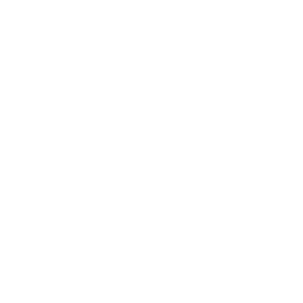
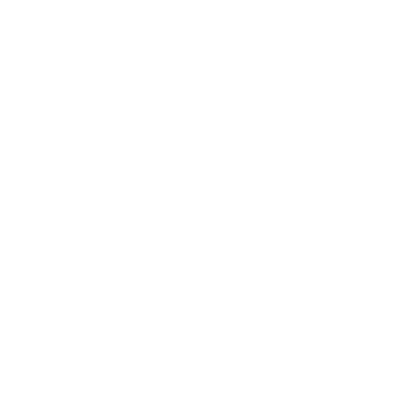

<h1 align="center"></h1>


<h3 align="center">
  Karu is an app that tries to help people with learning vocabulary of another language, in a gamified way. 
  The app is currently more aimed for children, but there are plans to make Karu enjoyable for all ages.
  
</h3>
<h6>
  This version of Karu is a prototype, school-project-version of a greater goal. This is also why there are lot's of features missing, and why I
  won't be optimizing the layout for Windows. More on this at the [Future](#future) section.
</h6>

## Table of Contents
- [About](#about)
- [Features](#features)
- [Installation](#installation)
- [Usage](#usage)
  - [Gameplay](#gameplay)
  - [Shop](#shop)
  - [Settings](#settings) 
- [Future](#future)

## About
When I began with my programming course, I was allowed to choose what I wanted to do for my first project. I decided to make a simple, CLI application that retrieves tables from
an online dictionary, save them in a .xml file and display them with a ````Pandas dataframe```. At the time, was starting to learn Ambonese (a creole language from the Central Moluccan Islands) and
the dictionary that I used only allow to search Ambonese words, while I also wanted to be able to search English words to get the translation. This is why my project would be a win-win: I could learn
about Python, Pandas and a bit of web-scraping, while also be able to learn Ambonese in a more efficient way.

The project was pretty simple at first, but I kept adding new features, like adding words to a personal list, a quiz, adding your own words, et cetera. Although I was pretty satisfied and proud
of the work that I put in, I also noticed that it was hard for my family and friends to figure out what was going on (CLI always seem to look like some advanced hacking-tool to most people). This led
me to decide that I wanted to turn the simple CLI application into a gamified, user-friendly, language learning app. Besides the things that I learned when making the CLI app, I didn't have much
experience with Python, and I knew a whole lot less about making GUI's. I had a classmate once that used Kivy, and that seemed fine to use for this, not-too-difficult, project.

Because it all started with the Ambonese language, I wanted the mascot to be an animal that was endemic to the Moluccan islands. This was pretty difficult, because the islands are home to hundreds of species of birds of paradise, which weren't really an option because of a notorious green owl mascot. Reptiles were also not viable, because there already was a lizard mascot that's related to learning the Dutch
dialect of Ambonese. While researching the islands' endemic animals, I finally found the perfect candidate: Moluccan Flying Fox (Pteropus chrysoproctus). In the almost extinct language of the island where
my family on my mother's side originates from, flying foxes are called "karunno". This is how Karu was born.

## Features
- 12 languages: Ambonese, Chinese, Dutch, English, French, German, Indonesian, Italian, Japanese, Korean, Russian and Spanish.
- Two word list categories: Animals, Home.
- Choose to translate from your first language to another language, or vice versa.
- Listen to how a word is pronounced.
- Improve your highscore by improving your vocabulary.
- Earn coins for each correct answer and use them to unlock new outfits for Karu, new themes, and new categories.
    - Themes have been implemented in a way that makes it easy to add new themes without too much hassle. The color of the chosen background is used to find a
      complementary color to use as the secondary/accent color.
    - New wordlists/categories are also easy to add and create, using the (Karu Translator)[https://github.com/Hitijahujessy/KaruTranslator]. Most of the time, you will only need to manually add the pictures.
 
## Installation
Karu uses Python 3.11.5, Kivy, and Pandas.

### Install Kivy
* These installation instsructions are copied from the  [Kivy docs](https://kivy.org/doc/stable/gettingstarted/installation.html). If anything goes wrong or is
* not clear, please refer to the [Kivy docs](https://kivy.org/doc/stable/gettingstarted/installation.html).

#### Create virtual environment
1. Create the virtual environment named kivy_venv in your current directory:
```
python -m virtualenv kivy_venv
```

2. Activate the virtual environment. You will have to do this step from the current directory every time you start a new terminal. This sets up the environment so
   the new kivy_venv Python is used.

For Windows default CMD, in the command line do:
```
kivy_venv\Scripts\activate
```

If you are in a bash terminal on Windows, instead do:
```
source kivy_venv/Scripts/activate
```
If you are in linux or macOS, instead do:
```
source kivy_venv/bin/activate
```
Your terminal should now preface the path with something like (kivy_venv), indicating that the kivy_venv environment is active. If it doesn’t say that, the virtual 
environment is not active and the following won’t work.

#### Using PIP
```
python -m pip install "kivy[base]"
```

### Installing Pandas
```
pip install pandas
```
or
```
python -m pip install pandas
```

## Usage

### Run main.py
To open the app, you need to run ```main.py```. You can run it using your preffered IDE, or using the terminal.
Before running ```main.py```, please make sure to activate your ```virtual environment``` and that you have installed ```Kivy``` and ```Pandas```.

### Main menu
After opening the app, you will see the main menu. At the top, the Karu logo is displayed. The user is able to change Karu's outfit at the shop. Below the
logo, you are able to see the amount of coins you own, and your current highscore. Finally, you will see three buttons with the following icons:

  -  - Start the game.
  -  - Go to the shop, where you can unlock and select new outfits, themes and categories.
  -  - Change the settings, currently only used for switching between the different languages.

### Gameplay
After a 3 second countdown, the game begins. A few things will appear, which uses are explained here:

  -  • Pauses the game and opens a popup with: sliders for setting the volume (not yet functional), resume game button, return to main menu button.
  -  • Score board, shows the current score, the highscore and the amount of coins that are earned in this game.
  -  • Hint (letter) button, reveals the first letter to be typed (max. 5 uses per game).
  -  • Hint (sound) button, plays an audio file where the word is pronounced (max. 5 uses per game).
  -  • The current word, it shows the word-to-be-translated at the top, and an image of the word.
  -  • Skip button, allows the user to not get stuck during a game by revealing the word (grants no points nor coins).
  -  • These are where the typed letters appear. Can be pressed to fix a typo. Current position is displayed using the accent color.
  -  • A total of 18 buttons that contain the letters of the word and random letters, displayed in a random order. 

Each game consists of 10 levels. Per level, a maximum of 40 ```points``` and 10 ```coins``` can be earned, and these numbers get lower by making mistakes and by using hints.
If no mistakes were made and no hints were used, it counts as ```flawless``` and 40 points are rewarded. Otherwise, the amount of points are calculating as follows:
```points = 30 - (letter-hints used * 3 + mistakes * 3 + sound-hints used * 5``` (see ```main.py line 908```)
  • So if I were to use 1 sound-hint, 2 letter-hints and made 1 mistake: ```points = 30 - (2 * 3 + 1 * 3 + 1 * 5) = 18 points```

Coins are also calculated per level, but are only payed out if the user completes the entire game. This is to prevent users from farming coins by restarting as soon as mistakes are made or levels
are skipped. If the level was ```flawless```, the user receives 10 ```coins```, if the level was skipped, the user receives 0 ```coins```, and otherwise the user receives 5 ```coins```. I chose to do it this waybecause I think that making mistakes is an important part of learning and learning should be rewarded.

Each correct answer is saved and can be used to unlock things in the shop.

<div class="row">
  
  
</div>

### Shop
When opening the shop section, you will find 4 buttons with the following icons:

  -  • Unlock and select different themes.
  -  • Unlock and select different word categories.
  -  • Unlock and select different outfits for Karu.
  -  • Return to main menu

Themes, categories and outfits can be unlocked by using ```coins``` or by the amount of ```correct answers``` given during the game. For example, the default category is "Home", which contains
a list of words that you will find in and around the house, such as "couch", "bed", or "television". To unlock the "Animals" category, you need 35 ```correct answers```. This means that
the user needs to play at least 4 times to unlock the new category, assuming that the user finishes 3 games without skipping and the 4th game without skipping more than 5 words.

There are 12 themes, including the default theme, of which 3 themes can be unlocked using ```correct answers```. The rest cost 250 ```coins```. A theme consists of 2 parts: the background image,
and the accent color. The accent color is created dynamically, based on the color of the background image. This is currently not foolproof, because the in-game text can sometimes be a bit hard
to read. 


There are 2 categories, including de default. The "Home" category consists of 11 words and the "Animals" category consists of 34 words. 

There are 3 outfits, including the default outfit. Currently, Karu doesn't have a body yet so the outfits only affect is head. There are plans to create a body and different animations for multiple
scenarios, but for now Karu is just a selfie.

<div class="row">
  
  
</div>

### Settings
At the settings section, there are 2 lists above eachother with country flags. I refer to them as the ```origin language``` and the  ```destination language```. With hindsight, it was better to use
something like ```main language``` or whatever, but this works fine for me. The ```origin language``` is likely to be the language the user is already familiar with. In-game, the word displayed above
the image is writtin in the ```origin language```, and the word that has to be the answer is written in the ```destination language```. 

It is important to note that almost every language is just a place-holder and was used for me to play around with this app's (and [KaruTranslator]'s) functions by allowing multiple languages. I
haven't studied Chinese or Italian so there might be tons of errors. Everything is 98% Google Translate, except for Dutch, Indonesian, Ambonese and English.

More features are planned for this section, like volume regulators, statistics, and an optional reset function.

<div class="row">
  
  
</div>


## Future

As you may have found out by reading this README or by running Karu, there a lots of things to add and improve. The UI is not optimized for Windows computers, the MacOS version isn't that good either,
multiple gameplay functions are incomplete or non-existent, et cetera. I have learned a lot during the development of this project and it was a great experience. One thing I do realize now is that Python
and Kivy are not ideal for developing apps like Karu. This is why I decided that I will completely remake this app in C#.

I call it a remake, but it's more like a "final piece". If the C# version of Karu would be a painting, the current version wouldn't even be sketch. Instead, it was practice, an idea, and an example of both 
the dos and don'ts. That being said, I still have to learn the basics of C#, so the road might be quite long. I am, however, very excited and motivated to turn this thing into a functional product to be proud of.

