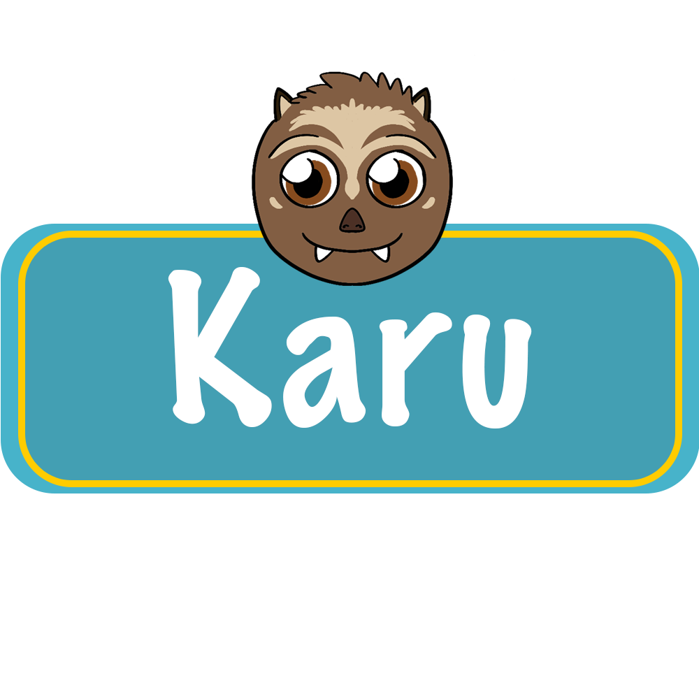

<h1 align="center"></h1>


<p align="center">
  Karu is an app that tries to help people with learning vocabulary of another language, in a gamified way. 
  The app is currently more aimed for children, but there are plans to make Karu enjoyable for all ages. 
</p>

## Table of Contents
- [Features](#features)
- [Installation](#installation)
- [Usage](#usage)
- [Contributing](#contributing)
- [License](#license)

## Features
- 12 languages: Ambonese, Chinese, Dutch, English, French, German, Indonesian, Italian, Japanese, Korean, Russian and Spanish.
- Two word list categories: Animals, Home.
- Choose to translate from your first language to another language, or vice versa.
- Listen to how a word is pronounced.
- Improve your highscore by improving your vocabulary.
- Earn coins for each correct answer and use them to unlock new outfits for Karu, new themes, and new categories.
    - Themes have been implemented in a way that makes it easy to add new themes without too much hassle. The color of the chosen background is used to find a
      complementary color to use as the secondary/accent color.
    - New wordlists/categories are also easy to add and create, using the [Karu Translator]. Most of the time, you will only need to manually add the pictures.
## Installation
Karu uses Python 3.11.5, Kivy, and Pandas.

### Install Kivy
* These installation instsructions are copied from the  [Kivy docs](https://kivy.org/doc/stable/gettingstarted/installation.html). If anything goes wrong or is
* not clear, please refer to the [Kivy docs](https://kivy.org/doc/stable/gettingstarted/installation.html).

#### Create virtual environment
1. Create the virtual environment named kivy_venv in your current directory:
```
python -m virtualenv kivy_venv
```

2. Activate the virtual environment. You will have to do this step from the current directory every time you start a new terminal. This sets up the environment so
   the new kivy_venv Python is used.

For Windows default CMD, in the command line do:
```
kivy_venv\Scripts\activate
```

If you are in a bash terminal on Windows, instead do:
```
source kivy_venv/Scripts/activate
```
If you are in linux or macOS, instead do:
```
source kivy_venv/bin/activate
```
Your terminal should now preface the path with something like (kivy_venv), indicating that the kivy_venv environment is active. If it doesn’t say that, the virtual 
environment is not active and the following won’t work.

#### Using PIP
```
python -m pip install "kivy[base]"
```

### Installing Pandas
```
pip install pandas
```
or
```
python -m pip install pandas
```

## Usage

### Run main.py
To open the app, you need to run ```main.py```. You can run it using your preffered IDE, or using the terminal.
Before running ```main.py```, please make sure to activate your ```virtual environment``` and that you have installed ```Kivy``` and ```Pandas```.

### Main menu
After opening the app, you will see the main menu. At the top, the Karu logo is displayed. The user is able to change Karu's outfit at the shop. Below the
logo, you are able to see the amount of coins you own, and your current highscore. Finally, you will see three buttons with the following icons:

  •  - Start the game.
  •  - Go to the shop, where you can unlock and select new outfits, themes and categories.
  •  - Change the settings, currently only used for switching between the different languages.

### Gameplay
After a 3 second countdown, the game begins. A few things will appear, which uses are explained here:

  •  - Pauses the game and opens a popup with: sliders for setting the volume (not yet functional), resume game button, return to main menu button.
  •  - Score board, shows the current score, the highscore and the amount of coins that are earned in this game.
  •  - Hint (letter) button, reveals the first letter to be typed (max. 5 uses per game).
  •  - Hint (sound) button, plays an audio file where the word is pronounced (max. 5 uses per game).
  •  - The current word, it shows the word-to-be-translated at the top, and an image of the word.
  •  - Skip button, allows the user to not get stuck during a game by revealing the word (grants no points nor coins).
  •  - These are where the typed letters appear. Can be pressed to fix a typo. Current position is displayed using the accent color.
  •  - A total of 18 buttons that contain the letters of the word and random letters, displayed in a random order. 

Each game consists of 10 levels. Per level, a maximum of 40 points and 10 coins can be earned, and these numbers get lower by making mistakes and by using hints.
If no mistakes were made and no hints were used, it counts as ```flawless``` and 40 points are rewarded. Otherwise, the amount of points are calculating as follows:
```points = 30 - (letter-hints used * 3 + mistakes * 3 + sound-hints used * 5``` (see ```main.py line 908```)
  • So if I were to use 1 sound-hint, 2 letter-hints and made 1 mistake: ```points = 30 - (2 * 3 + 1 * 3 + 1 * 5) = 18 points```

Coins are also calculated per level, but are only payed out if the user completes the entire game. This is to prevent users from farming coins by restarting as soon as mistakes are made or levels
are skipped. If the level was ```flawless```, the user receives 10 coins, if the level was skipped, the user receives 0 coins, and otherwise the user receives 5 coins. I chose to do it this way
because I think that making mistakes is an important part of learning and learning should be rewarded.
